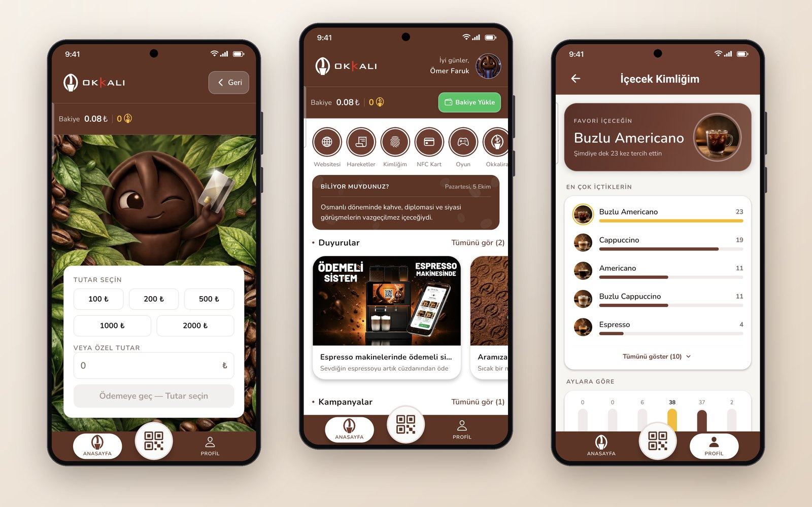
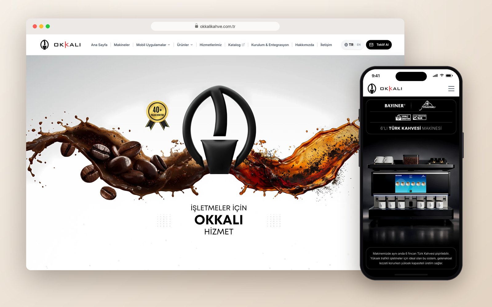

  

  
  
  

---

### About me

I'm a software engineer working where **mobile, web and hardware** meet. At **Okkalı Kahve**, I build the software that connects IoT coffee and tea machines with their users, the production line and field teams.

- Taking products from idea to launch and owning them until they run reliably in the field
- Shipping a consumer payment app used at the machines, live on the App Store and Google Play
- Writing the glue between apps and hardware: NFC, USB serial, barcode scanners, label printers, microcontrollers
- B.Sc. Computer Engineering, Sakarya University

---

### Tech stack

  
   
  

---

### Featured work

<table>
  <tr>
    <td width="50%" valign="top">
      
      <h4>Okkalı Kahve App</h4>
      
Consumer payment and loyalty app: QR payment at the machine, in-app wallet, loyalty points, NFC cards and personal drink stats.

      

        
        
        
      

      <a href="https://apps.apple.com/tr/app/okkal%C4%B1-kahve/id6760692481">App Store</a> · <a href="https://play.google.com/store/apps/details?id=com.bayineriot.okkalikahve">Google Play</a>
    </td>
    <td width="50%" valign="top">
      
      <h4>okkalikahve.com.tr</h4>
      
Bilingual corporate website with a filterable machine catalog, detailed product pages and a quote request form, built for speed and search.

      

        
        
        
      

      <a href="https://okkalikahve.com.tr">Visit website</a>
    </td>
  </tr>
</table>

### Personal projects

| Project | What it does | Stack |
|---|---|---|
| [**PolicyGPT**](https://github.com/omeraydin00/PolicyGPT) | Turns government-procedure documents into interactive step-by-step guides with a local RAG pipeline | Ollama · LangChain · Flask |
| [**VoiceGPT**](https://github.com/omeraydin00/VoiceGPT) | Turkish voice assistant with local speech recognition and a local LLM, plus spoken replies | Whisper · Llama 3 · Gradio |
| [**Customer Support Agent**](https://github.com/omeraydin00/customer-support-agent) | Local LLM support assistant with intent detection, sentiment analysis and auto-replies | Python · Streamlit · Ollama |
| [**Ollama-Agent-Kit**](https://github.com/EmreMutlu99/Ollama-Agent-Kit) | Memory-enabled LLM agent with tool calling, built during my internship at Sagel AI | Node.js · Ollama |

---

### Contributions

  

  

